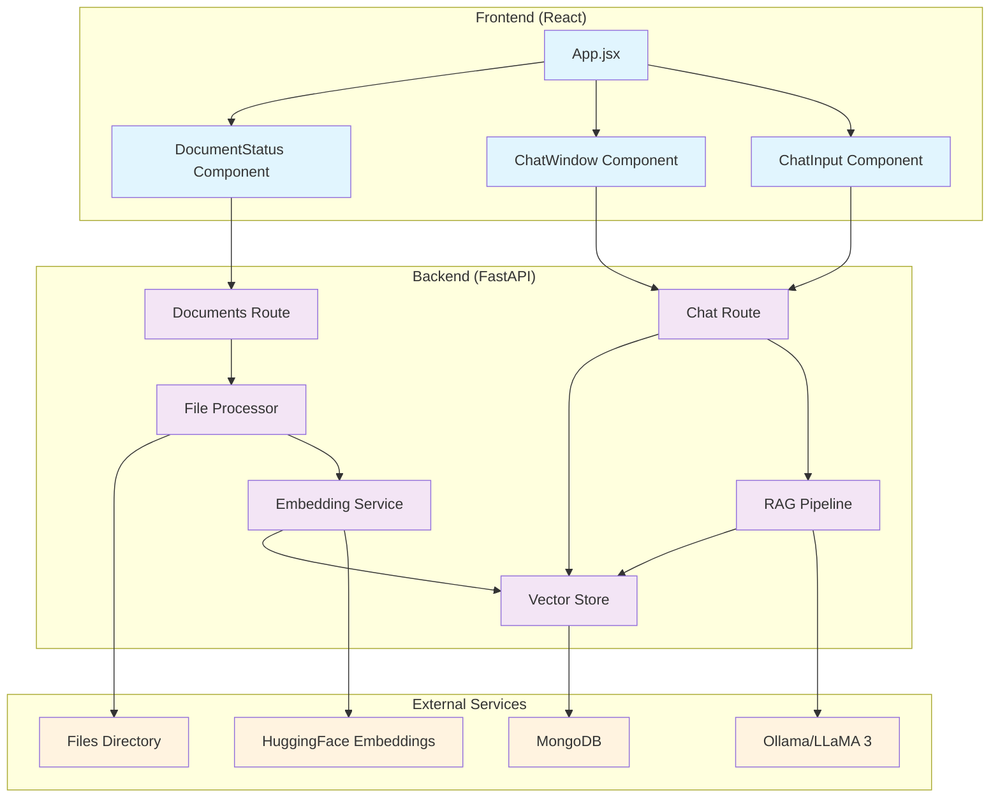

# System Architecture

## Architecture Diagram

## Data Flow

1. **File Processing Flow**:
   - Application starts → File Processor scans files directory
   - PDF files found → Text extracted and chunked → Embedding Service
   - Embeddings generated → Vector Store
   - Chunks stored in MongoDB with vector embeddings

2. **Chat Flow**:
   - User types query → ChatInput component
   - Query sent to `/api/chat` → RAG Pipeline
   - Query embedded → Vector Store
   - Similar chunks retrieved from MongoDB
   - Context built → LLaMA 3 model
   - Response generated → ChatWindow component

3. **Reload Flow**:
   - User clicks reload → DocumentStatus component
   - Request sent to `/api/reload` → File Processor
   - Existing chunks cleared → Files reprocessed → New chunks stored

## Technology Stack

- **Frontend**: React 18, TailwindCSS, Axios
- **Backend**: FastAPI, Pydantic, Motor (async MongoDB)
- **Database**: MongoDB with vector search
- **ML Models**: 
  - Embeddings: sentence-transformers/all-MiniLM-L6-v2
  - LLM: LLaMA 3 via Ollama
- **PDF Processing**: PyPDF, LangChain text splitters

## Key Components

### Backend Services

1. **FileProcessor**: Handles PDF text extraction and chunking from files directory
2. **EmbeddingService**: Generates text embeddings using HuggingFace
3. **VectorStore**: Manages MongoDB vector operations and similarity search
4. **RAGPipeline**: Orchestrates retrieval and generation process

### Frontend Components

1. **DocumentStatus**: Handles document reload and reset functionality
2. **ChatWindow**: Displays conversation history with message bubbles
3. **ChatInput**: Text input with send functionality
4. **App**: Main application component managing state

### API Endpoints

- `POST /api/reload` - Reload and process all files from files directory
- `POST /api/chat` - Send chat message and get AI response
- `GET /api/status` - Get current document status
- `DELETE /api/reset` - Clear all stored documents
- `GET /api/health` - Health check endpoint
