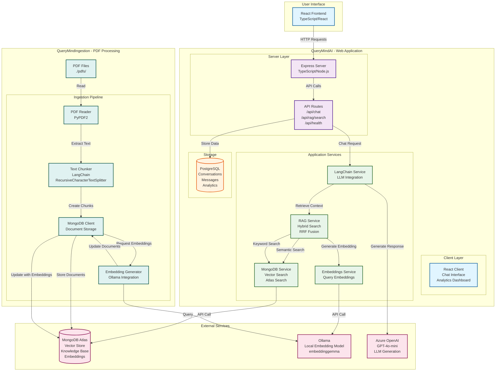

# QueryMind AI Architecture

This document describes the architecture of the QueryMind AI system, which consists of two main components: **QueryMindAI** (web application) and **QueryMindIngestion** (PDF ingestion tool).

## System Overview

QueryMind AI is a RAG (Retrieval-Augmented Generation) powered chatbot that uses LLM and vector search to answer questions based on ingested PDF documents.

## Architecture Diagram

*Visual architecture diagram showing the complete system integration*

### Interactive Diagram (Mermaid)

## Component Details

### QueryMindAI - Web Application

#### Frontend (Client)
- **Technology**: React, TypeScript, Vite
- **Components**:
  - Chat interface with message bubbles
  - Analytics dashboard
  - Theme toggle (dark/light mode)
  - Real-time typing indicators
- **Location**: `QueryMindAI/client/`

#### Backend (Server)
- **Technology**: Express.js, TypeScript, Node.js
- **Key Services**:
  - **LangChain Service**: Integrates with Azure OpenAI for LLM generation
  - **RAG Service**: Implements hybrid search combining:
    - Semantic search (vector similarity using embeddings)
    - Keyword search (MongoDB Atlas Search with BM25)
    - Reciprocal Rank Fusion (RRF) to combine results
  - **Embeddings Service**: Generates query embeddings using Ollama
  - **MongoDB Service**: Performs vector similarity search and Atlas Search
- **API Endpoints**:
  - `POST /api/chat` - Chat with RAG enhancement
  - `GET /api/rag/search` - Search knowledge base
  - `GET /api/rag/status` - Check RAG service status
  - `GET /api/health` - Health check
  - `GET /api/conversation/:id` - Get conversation history
  - `GET /api/analytics/:sessionId` - Get session analytics
- **Location**: `QueryMindAI/server/`

#### Storage
- **PostgreSQL**: Stores conversations, messages, and analytics data
- **MongoDB Atlas**: Vector store for knowledge base documents with embeddings

### QueryMindIngestion - PDF Processing Tool

#### Components
- **PDF Reader**: Extracts text from PDF files using PyPDF2
- **Text Chunker**: Splits PDF text into chunks using LangChain's RecursiveCharacterTextSplitter
- **MongoDB Client**: Stores chunked documents in MongoDB
- **Embedding Generator**: Generates embeddings for each chunk using Ollama's embeddinggemma model

#### Processing Flow
1. Read PDF files from `./pdfs/` directory
2. Extract text content from each PDF
3. Chunk text into manageable pieces (configurable chunk size and overlap)
4. Store chunks as documents in MongoDB
5. Generate embeddings for each chunk using Ollama
6. Update MongoDB documents with embeddings

#### Location: `QueryMindIngestion/`

## Data Flow

### Chat Flow (Query Time)
1. User sends message via React frontend
2. Express server receives request at `/api/chat`
3. RAG service generates query embedding using Ollama
4. RAG service performs hybrid search:
   - Semantic search: Vector similarity in MongoDB
   - Keyword search: BM25 search via MongoDB Atlas Search
   - Combine results using Reciprocal Rank Fusion
5. Retrieved context is passed to LangChain service
6. LangChain service calls Azure OpenAI with context + conversation history
7. Response is returned to user with source attribution
8. Conversation is stored in PostgreSQL

### Ingestion Flow (Indexing Time)
1. PDF files are placed in `./pdfs/` directory
2. PDF Reader extracts text from each PDF
3. Text Chunker splits text into semantic chunks
4. Chunks are stored in MongoDB as documents
5. Embedding Generator creates embeddings for each chunk using Ollama
6. MongoDB documents are updated with embedding vectors
7. MongoDB indexes are created for efficient search

## Technology Stack

### QueryMindAI
- **Frontend**: React, TypeScript, Vite, Tailwind CSS
- **Backend**: Express.js, TypeScript, Node.js
- **AI/ML**: LangChain, Azure OpenAI, Ollama
- **Database**: PostgreSQL (conversations), MongoDB Atlas (vector store)
- **Vector Search**: MongoDB aggregation pipeline (cosine similarity), MongoDB Atlas Search (BM25)

### QueryMindIngestion
- **Language**: Python 3.8+
- **Libraries**: LangChain, PyPDF2, PyMongo, Ollama client
- **Embedding Model**: embeddinggemma (via Ollama)

## External Dependencies

1. **MongoDB Atlas**: Cloud-hosted MongoDB for vector storage
   - Stores knowledge base documents with embeddings
   - Supports vector similarity search and Atlas Search

2. **Ollama**: Local embedding generation service
   - Model: `embeddinggemma`
   - Used by both ingestion and query services

3. **Azure OpenAI**: Cloud LLM service
   - Model: GPT-4o-mini
   - Used for generating chat responses

## Key Features

- **Hybrid Search**: Combines semantic (vector) and keyword (BM25) search
- **Reciprocal Rank Fusion**: Intelligently merges results from multiple search methods
- **Source Attribution**: Provides transparency by showing which documents were used
- **Conversation Management**: Maintains conversation history in PostgreSQL
- **Analytics**: Tracks message counts, response times, and conversation metrics
- **Real-time UI**: Typing indicators and responsive chat interface

## Configuration

Both components use environment variables for configuration:

### QueryMindAI
- `MONGODB_URI`: MongoDB connection string
- `AZURE_OPENAI_API_KEY`: Azure OpenAI API key
- `AZURE_OPENAI_ENDPOINT`: Azure OpenAI endpoint
- `OLLAMA_BASE_URL`: Ollama server URL (default: http://localhost:11434)
- `PORT`: Server port (default: 5000)

### QueryMindIngestion
- `PDF_FOLDER_PATH`: Path to PDF files directory
- `MONGODB_URI`: MongoDB connection string
- `MONGODB_DATABASE`: Database name
- `MONGODB_COLLECTION`: Collection name
- `OLLAMA_BASE_URL`: Ollama server URL
- `CHUNK_SIZE`: Text chunk size (default: 1000)
- `CHUNK_OVERLAP`: Chunk overlap size (default: 200)

